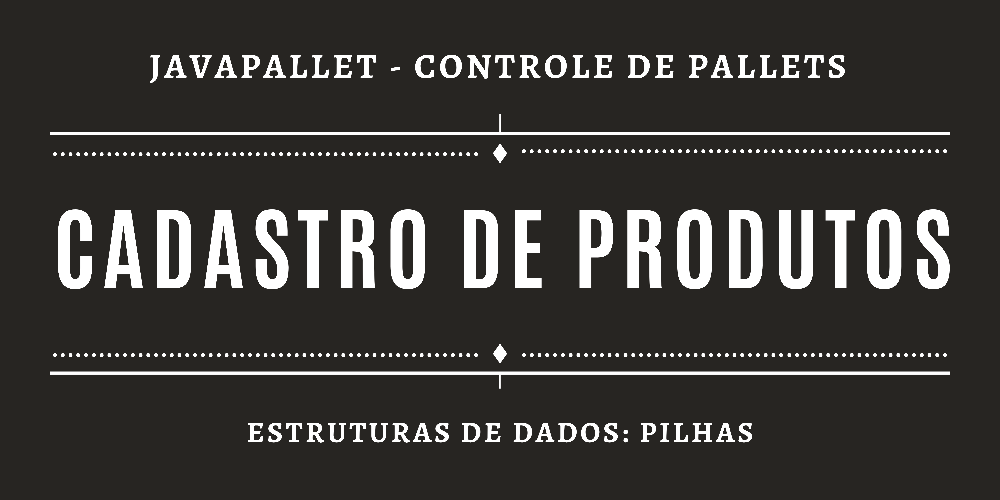

  

  
  
  
    
   
     

<h1 align="center">
    
</h1>

<h4 align="center"> 
	🚧 JavaPallet 📦 Concluído 📘 🚧
</h4>

 <a href="#-sobre-o-projeto">Sobre</a> •
 <a href="#-funcionalidades">Funcionalidades</a> •
 <a href="#-como-executar-o-projeto">Como executar</a> • 
 <a href="#-tecnologias">Tecnologias</a> • 
 <a href="#-autor">Autor</a> • 
 <a href="#user-content--licença">Licença</a>

## 💻 Sobre o projeto

📦 JavaPallet - é um sistema que permite o gerenciamento de uma pilha de pallets. Trata-se de um sistema conceitual, para fixar o conteúdo de pilhas, da disciplina Estrutura de Dados I.

Projeto desenvolvido durante a disciplina **Estrutura de Dados I**, no curso Bacharelado em Sistemas de Informação oferecido pelo [IFSul de Minas Gerais - Campus Machado](https://portal.mch.ifsuldeminas.edu.br).

---

## ⚙️ Funcionalidades

- [x] O usuário pode cadastrar produtos e suas respectivas quantidades.
- [x] O usuário tem controle nos produtos contidos na pilha, podendo acessá-los em quaisquer posições.

---

## 🚀 Como executar o projeto

Este projeto é desenvolvido para computadores.
Para ser executado, basta ter instalado no computador o Java, que pode ser instalado [aqui](https://www.java.com/pt-BR/download/ie_manual.jsp?locale=pt_BR).
Com o Java instalado, acesse o diretório "./javapallet/dist", e execute o arquivo "JavaPallet.jar".

Para editar o projeto, é necessário ter instalado na máquina o JDK (versão 17.0.1 ou mais recente) e uma IDE (Integrated Developmente Environment).
A IDE recomendável é NetBeans.

## 🛠 Tecnologias

Foi utilizada a ferramenta NetBeans, para programar em Java.

## 🦸 Autor

<a href="https://github.com/josuemleite/">
 
  
 <b>Josué Melquisedeque Leite</b></a> <a href="https://github.com/josuemleite/" title="GitHub perfil">🚀</a>
 
  
  

 
 
 

---

## 📝 Licença

Este projeto está sob a licença [MIT](./LICENSE).

Feito com ❤️ por Josué Melquisedeque Leite 👋🏽 [Entre em contato!](https://www.linkedin.com/in/josué-leite-770962201/)

---
